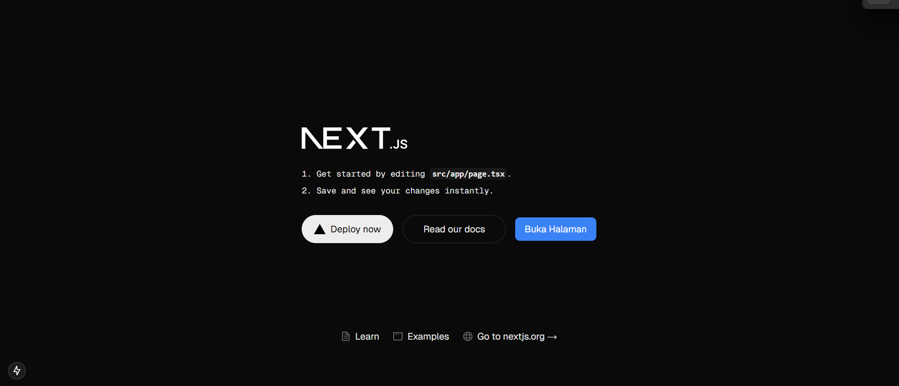
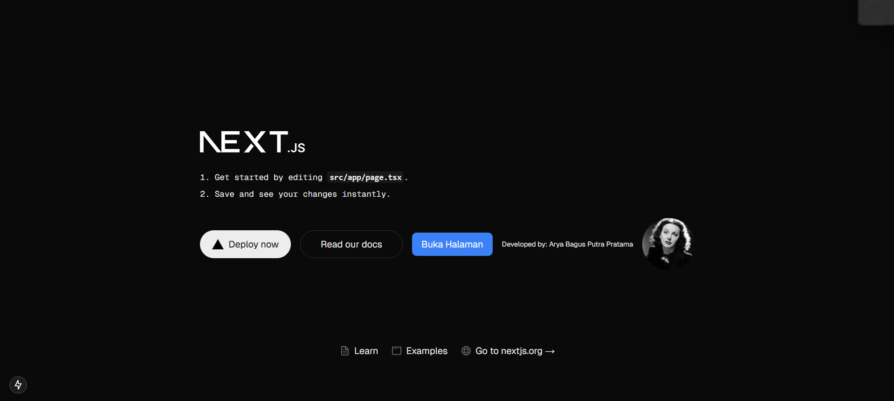

This is a [Next.js](https://nextjs.org) project bootstrapped with [`create-next-app`](https://nextjs.org/docs/app/api-reference/cli/create-next-app).

## Getting Started

First, run the development server:

```bash
npm run dev
# or
yarn dev
# or
pnpm dev
# or
bun dev
```

Open [http://localhost:3000](http://localhost:3000) with your browser to see the result.

You can start editing the page by modifying `app/page.tsx`. The page auto-updates as you edit the file.

This project uses [`next/font`](https://nextjs.org/docs/app/building-your-application/optimizing/fonts) to automatically optimize and load [Geist](https://vercel.com/font), a new font family for Vercel.

## Laporan Pratikum

|  | Pemrograman Berbasis Framework 2024 |
|--|--|
| NIM |  2241720094|
| Nama |  Arya Bagus Putra Pratama |
| Kelas | TI - 3C |

### Jawaban Soal Pratikum 1

# Praktikum: Instalasi Git, VS Code, dan Node.js

## 1. Git
**Git** adalah Version Control System (VCS) yang digunakan untuk mengelola perubahan kode dalam proyek pengembangan perangkat lunak.

### 📌 Kegunaan Git dalam Praktikum:
- Melacak perubahan kode dalam proyek.
- Memungkinkan kolaborasi dengan tim menggunakan repositori online seperti GitHub.
- Mengembalikan versi sebelumnya jika terjadi kesalahan dalam pengembangan.

### 🔧 Perintah Dasar Git:
```sh
git init        # Membuat repositori baru
git clone <url> # Menyalin repositori dari GitHub
git add .       # Menambahkan semua perubahan ke staging area
git commit -m "Pesan commit" # Menyimpan perubahan dengan pesan
git push origin main # Mengunggah perubahan ke repositori online
```

---

## 2. VS Code (Visual Studio Code)
**VS Code** adalah text editor ringan dan powerful untuk menulis serta mengedit kode program.

### 📌 Kegunaan VS Code dalam Praktikum:
- Menyediakan fitur auto-completion (IntelliSense) untuk mempercepat penulisan kode.
- Mendukung debugging untuk berbagai bahasa pemrograman.
- Memiliki integrasi dengan Git untuk manajemen kode versi.

### 🔧 Fitur Utama VS Code:
- **Terminal Terintegrasi:** Menjalankan perintah langsung di dalam VS Code.
- **Extensions:** Menambahkan fitur tambahan seperti support untuk Laravel, Node.js, dan lainnya.
- **Git Integration:** Memudahkan commit dan push kode ke GitHub langsung dari VS Code.

---

## 3. Node.js
**Node.js** adalah runtime JavaScript yang memungkinkan eksekusi kode JavaScript di luar browser.

### 📌 Kegunaan Node.js dalam Praktikum:
- Menjalankan aplikasi backend berbasis JavaScript.
- Mengelola dependensi proyek menggunakan **npm (Node Package Manager)**.
- Membantu dalam pengembangan aplikasi berbasis Express.js.

### 🔧 Perintah Dasar Node.js:
```sh
node -v        # Mengecek versi Node.js
npm -v         # Mengecek versi npm
npm init       # Menginisialisasi proyek Node.js
npm install <package> # Menginstal package dari npm
```

---

## Kesimpulan
Dengan menginstal **Git, VS Code, dan Node.js**, kita dapat mengembangkan aplikasi secara lebih efisien:
- **Git** membantu dalam manajemen versi kode.
- **VS Code** mempermudah penulisan dan debugging kode.
- **Node.js** memungkinkan pengembangan aplikasi berbasis JavaScript di backend.


### Jawaban Soal Pratikum 2
### TypeScript
- **Superset dari JavaScript** yang menambahkan fitur **static typing**.
- Membantu mendeteksi kesalahan sejak tahap pengembangan.
- Contoh penggunaan:
  ```ts
  function greet(name: string): string {
    return `Hello, ${name}`;
  }
  console.log(greet("Next.js"));
  ```

### ESLint
- **Linter untuk JavaScript dan TypeScript** guna menjaga konsistensi kode dan mendeteksi kesalahan potensial.
- Contoh aturan dalam konfigurasi:
  ```json
  {
    "rules": {
      "semi": ["error", "always"],
      "quotes": ["error", "double"]
    }
  }
  ```

### Tailwind CSS
- **Framework CSS berbasis utility-first** yang memungkinkan pengembangan desain yang fleksibel dan cepat.
- Contoh penggunaan dalam JSX:
  ```jsx
  <button className="bg-blue-500 text-white px-4 py-2 rounded">
    Klik Saya
  </button>
  ```

### App Router
- **Sistem routing baru di Next.js** yang menggantikan sistem `pages/`.
- Contoh struktur:
  ```
  app/
  ├── layout.tsx
  ├── page.tsx
  ├── dashboard/
  │   ├── page.tsx
  │   ├── settings.tsx
  ```

### Import Alias
- **Mempermudah impor modul dengan path yang lebih pendek**.
- Contoh konfigurasi dalam `tsconfig.json`:
  ```json
  {
    "compilerOptions": {
      "paths": {
        "@components/*": ["./components/*"]
      }
    }
  }
  ```
- Contoh penggunaan dalam kode:
  ```tsx
  import Button from "@components/Button";
  ```

### Turbopack
- **Bundler generasi baru untuk Next.js**, menggantikan Webpack dan Vite.
- Diklaim lebih cepat dan lebih efisien dalam membundel kode.

---
### Jawaban Soal Pratikum 3


---
### Jawaban Soal Pratikum 4
## Penjelasan Sintaks `user.imageUrl`
Pada kode berikut:
```jsx
const user = {
  name: 'Arya Bagus Putra Pratama',
  imageUrl: 'https://i.imgur.com/yXOvdOSs.jpg',
  imageSize: 90,
};

function Profile() {
  return (
    <>
      <div className="text-xs">Developed by: {user.name}</div>
      
    </>
  );
}
```

### 📌 Kegunaan `user.imageUrl`:
- **Mengambil nilai properti `imageUrl` dari objek `user`**, yang berisi URL gambar profil.
- **Digunakan sebagai sumber (`src`) pada elemen ``**, sehingga gambar profil dapat ditampilkan di halaman web.
- **Menampilkan gambar pengguna secara dinamis** sesuai dengan data yang diberikan dalam objek `user`.

### 🔧 Penjelasan dalam elemen ``:
```jsx

```
Dengan cara ini, kita dapat menampilkan gambar berdasarkan data yang ada di dalam objek `user`, tanpa perlu menulis URL gambar secara manual.

---

